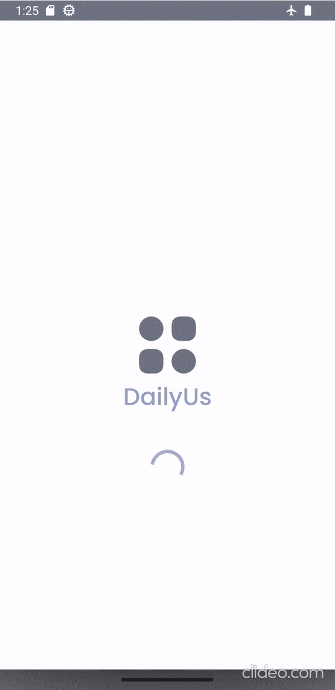
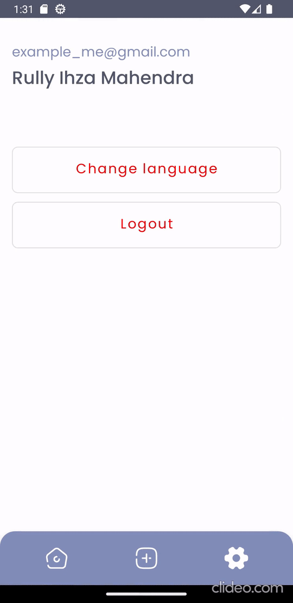

# DailyUs

This project was part of submission projects to finish the Dicoding Indonesia's Android Intermediate
course. The main purpose of this submission was to challenge students to create a
posting-stories-like Android app. The app being built had to be using Animation (ex. Property
Animation, Motion Animation, or Shared Element), Authentication (Login and Register), posting a new
story with photo and description, show story list, and creating a custom view.

## Preview

    

    

    

## Tech Stack

- Kotlin
- Coroutines
- MVVM Architecture
- Room and Retrofit (for local and remote data access)
- Dagger Hilt (Dependency Injection)
- Material Design
- Navigation Component
- Paging 3
- Shimmer Effect (for loading state)
- Glide (for loading and caching image)
- CameraX
- Localization (supports English and Indonesian)